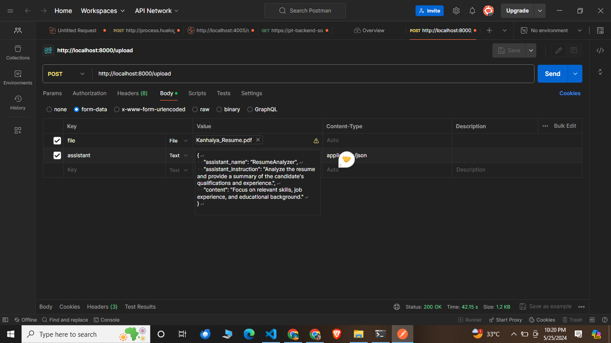

# ChatBot Assistant using Golang OpenAI package



This project provides a simple service to upload files and additional assistant data using the Gin framework in Go. The file and data are stored in a PostgreSQL database.

## Features

- Upload a file along with JSON data in a single request.
- Save the file content and assistant data to a PostgreSQL database.

## Requirements

- Go 1.16 or later
- PostgreSQL

## Setup

### 1. Clone the Repository

```sh
git clone https://github.com/kanhaiyagupta9045/Chat-Assistant-Using-Golang.git
cd Chat-Assistant-Using-Golang


